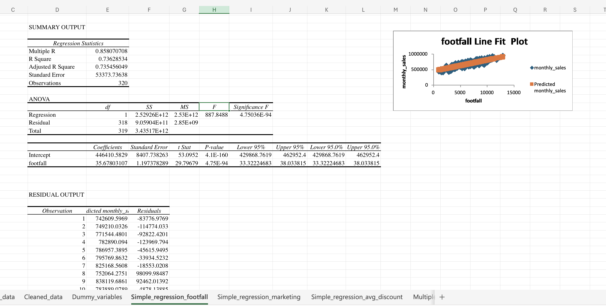
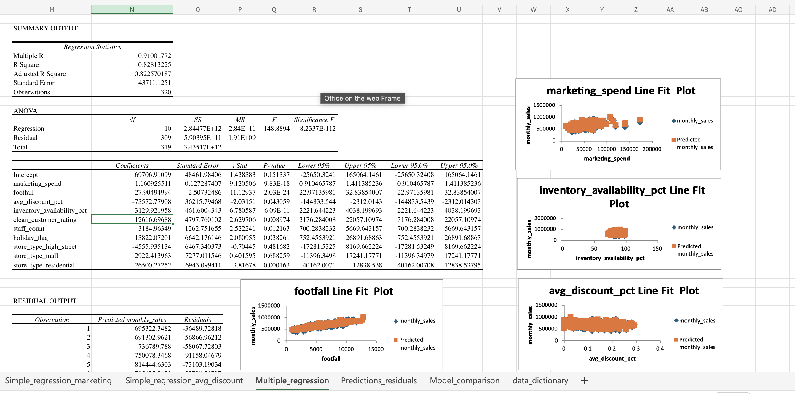
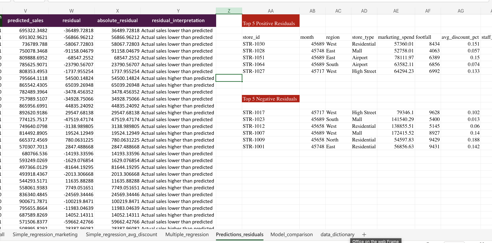
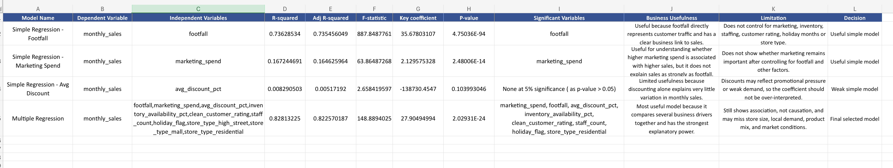

# Part 3: Regression-Based Business Insights and Model Interpretation

## Business Problem Summary

This project analyzes monthly sales performance for a retail chain. The leadership team wants to understand which factors are most strongly associated with `monthly_sales` so they can make better decisions about marketing spend, store traffic, discounting, inventory availability, staffing, holiday planning, and store-type strategy.

The analysis uses Excel-based regression models. Simple regression models are used to understand one predictor at a time, and a multiple regression model is used to evaluate several business drivers together. The final recommendation is based on the model evidence, residual analysis, and business interpretation.

## Dataset Description

The dataset contains 320 store-month observations. Each row represents one store's performance for one reporting month.

The original dataset is stored in:

`data/business_regression_data.xlsx`

Dataset link:

`https://drive.google.com/drive/folders/1Z1y5bAY5Ydfv4TJpm_CRuPHRTT4zr8ZN`

The dataset includes these fields:

| Column | Description |
|---|---|
| `store_id` | Unique store identifier |
| `month` | Reporting month |
| `region` | Business region of the store |
| `store_type` | Store format: Airport, High Street, Mall, or Residential |
| `marketing_spend` | Monthly marketing spend for the store |
| `footfall` | Monthly visitor count |
| `avg_discount_pct` | Average discount percentage for the month |
| `staff_count` | Number of staff members |
| `inventory_availability_pct` | Inventory availability percentage |
| `competitor_distance_km` | Distance to nearest competitor in kilometres |
| `holiday_flag` | Whether the month has a holiday period; 1 = holiday month, 0 = non-holiday month |
| `customer_rating` | Customer rating score |
| `monthly_sales` | Monthly sales value |
| `monthly_profit` | Monthly profit value |

## Task 1: Understand the Dataset

### Dependent Variable

The dependent variable is:

`monthly_sales`

This is the business outcome the regression models try to explain.

### Potential Independent Variables

The potential independent variables are:

- `marketing_spend`
- `footfall`
- `avg_discount_pct`
- `staff_count`
- `inventory_availability_pct`
- `competitor_distance_km`
- `holiday_flag`
- `customer_rating`
- `region`
- `store_type`

### Numerical Variables

The numerical variables are:

- `marketing_spend`
- `footfall`
- `avg_discount_pct`
- `staff_count`
- `inventory_availability_pct`
- `competitor_distance_km`
- `holiday_flag`
- `customer_rating`
- `monthly_sales`
- `monthly_profit`

### Categorical Variables

The categorical variables are:

- `store_id`
- `month`
- `region`
- `store_type`

`holiday_flag` is numeric, but it is also binary because it represents whether a month is a holiday month or not.

### Variables That May Need Cleaning or Transformation

`competitor_distance_km` and `customer_rating` contained missing values. These missing values were cleaned using median imputation. Median imputation was selected because it is less affected by outliers than mean imputation.

`store_type` is categorical, so it was transformed into dummy variables before being used in the multiple regression model.

`region` is also categorical. Region dummy variables were created in the workbook for preparation, but region was not included in the selected final regression model because the final model focused on store type and key operating variables.

### Variables That May Not Be Useful Directly for Regression

`store_id` is an identifier. It is useful for tracking records, but it should not be used directly as a numeric regression predictor.

`month` is a time variable. It may be useful for seasonality or trend analysis, but it was not used directly in this model.

`monthly_profit` was not used as an independent variable because it is another financial outcome and is closely connected to `monthly_sales`. Including it could make the model less useful for identifying operational sales drivers.

## Regression Approach

The analysis uses both simple linear regression and multiple linear regression.

Simple linear regression is used first to understand how one independent variable relates to `monthly_sales` at a time. Three simple regression models were created:

- `monthly_sales` vs `footfall`
- `monthly_sales` vs `marketing_spend`
- `monthly_sales` vs `avg_discount_pct`

These simple models help compare the standalone explanatory power of each variable.

Multiple linear regression is then used to analyze several sales drivers together. This is the final selected approach because retail sales are affected by more than one factor at the same time. The multiple regression model includes marketing, footfall, discounting, inventory availability, customer rating, staffing, holiday timing, and store-type dummy variables.

Excel Data Analysis ToolPak was used to generate the regression outputs. Formula-based workbook sheets were used for cleaning, dummy variable creation, predicted sales, residuals, and model comparison.

## Dummy Variable Approach

Dummy variables were created because `store_type` is categorical and cannot be directly used as text in regression.

The store type categories are:

- Airport
- High Street
- Mall
- Residential

Airport was selected as the reference category. Therefore, no separate Airport dummy variable was included in the model. Airport is represented when all store-type dummy variables are equal to 0.

The dummy variables used were:

- `store_type_high_street`
- `store_type_mall`
- `store_type_residential`

This avoids the dummy variable trap, where including all categories along with an intercept creates redundant information and multicollinearity. Each store-type dummy coefficient should be interpreted relative to Airport stores.

## Task 2: Prepare the Regression Workbook

The regression workbook is stored in:

`analysis/regression_workbook.xlsx`

The workbook contains the following sheets:

| Sheet | Purpose |
|---|---|
| `Original_data` | Preserves the original dataset without overwriting it |
| `Cleaned_data` | Contains cleaned fields and missing-value handling formulas |
| `Dummy_variables` | Contains dummy variables for categorical variables |
| `Simple_regression_footfall` | Excel ToolPak output for monthly sales vs footfall |
| `Simple_regression_marketing` | Excel ToolPak output for monthly sales vs marketing spend |
| `Simple_regression_avg_discount` | Excel ToolPak output for monthly sales vs average discount percentage |
| `Multiple_regression` | Excel ToolPak output for the selected multiple regression model |
| `Predictions_residuals` | Calculates predicted sales and residuals using the selected final model |
| `Model_comparison` | Compares the simple and multiple regression models |
| `data_dictionary` | Describes the dataset columns |

The original dataset was preserved in the workbook. Cleaning, dummy variables, predicted values, residuals, and comparison outputs were created in separate sheets.

## Task 3: Create Dummy Variables

Dummy variables were created for `store_type`.

The store type categories are:

- Airport
- High Street
- Mall
- Residential

Airport was used as the reference category. Therefore, no dummy variable was created for Airport.

The dummy variables used in the model are:

- `store_type_high_street`
- `store_type_mall`
- `store_type_residential`

Airport is represented when all three dummy variables are equal to 0.

This approach avoids the dummy variable trap. If all store-type categories were included along with an intercept, the model would contain redundant information because the dummy variables would perfectly add up to 1 for every record.

## Task 4: Simple Regression Models

Three simple linear regression models were run using Excel Data Analysis ToolPak. Each simple regression uses `monthly_sales` as the dependent variable and one independent variable at a time.

### Simple Regression Model 1: Footfall

| Required Item | Result |
|---|---|
| Dependent variable | `monthly_sales` |
| Independent variable | `footfall` |
| Regression equation | `monthly_sales = 446410.58 + 35.68 x footfall` |
| R-squared | `0.7363` |
| Coefficient | `35.68` |
| P-value | `4.75E-94` |
| Direction | Positive |
| Usefulness | Useful |

Business interpretation:

The footfall coefficient is positive. This means that higher customer traffic is associated with higher monthly sales. For every additional unit of footfall, monthly sales are estimated to increase by about 35.68, based on this simple model.

The R-squared value is 0.7363, which means footfall alone explains about 73.63% of the variation in monthly sales. The p-value is far below 0.05, so the relationship is statistically significant.

Conclusion:

`footfall` appears very useful. It has strong explanatory power, a clear business meaning, and a statistically significant p-value.

### Simple Regression Model 2: Marketing Spend

| Required Item | Result |
|---|---|
| Dependent variable | `monthly_sales` |
| Independent variable | `marketing_spend` |
| Regression equation | `monthly_sales = 560777.35 + 2.13 x marketing_spend` |
| R-squared | `0.1672` |
| Coefficient | `2.13` |
| P-value | `2.48E-14` |
| Direction | Positive |
| Usefulness | Useful, but weaker than footfall |

Business interpretation:

The marketing spend coefficient is positive. This means higher marketing spend is associated with higher monthly sales. For every additional unit of marketing spend, monthly sales are estimated to increase by about 2.13 in the simple regression model.

The p-value is below 0.05, so the relationship is statistically significant. However, the R-squared is only 0.1672, meaning marketing spend alone explains about 16.72% of monthly sales variation.

Conclusion:

`marketing_spend` appears useful because it is statistically significant and has a positive relationship with sales. However, it is not as strong as footfall as a standalone predictor.

### Simple Regression Model 3: Average Discount Percentage

| Required Item | Result |
|---|---|
| Dependent variable | `monthly_sales` |
| Independent variable | `avg_discount_pct` |
| Regression equation | `monthly_sales = 697835.63 - 138730.45 x avg_discount_pct` |
| R-squared | `0.0083` |
| Coefficient | `-138730.45` |
| P-value | `0.1040` |
| Direction | Negative |
| Usefulness | Weak as a standalone predictor |

Business interpretation:

The average discount coefficient is negative. This suggests that higher discount percentages are associated with lower monthly sales in the simple regression model. However, the p-value is 0.1040, which is greater than 0.05, so this relationship is not statistically significant at the 5% level.

The R-squared is only 0.0083, meaning average discount percentage alone explains less than 1% of the variation in monthly sales.

Conclusion:

`avg_discount_pct` does not appear useful as a standalone predictor. It should not be over-interpreted based only on the simple regression result.

## Task 5: Multiple Regression Model

A multiple regression model was run using Excel Data Analysis ToolPak. The dependent variable was `monthly_sales`.

The independent variables were:

- `marketing_spend`
- `footfall`
- `avg_discount_pct`
- `inventory_availability_pct`
- `clean_customer_rating`
- `staff_count`
- `holiday_flag`
- `store_type_high_street`
- `store_type_mall`
- `store_type_residential`

### Model Fit

| Metric | Result |
|---|---:|
| R-squared | `0.8281` |
| Adjusted R-squared | `0.8226` |

The R-squared value means the model explains about 82.81% of the variation in monthly sales. The adjusted R-squared is also high at 82.26%, which means the model remains strong even after accounting for the number of predictors.

### Intercept Interpretation

The intercept is `69706.91`.

This is the estimated monthly sales when all independent variables are zero and the store is in the Airport reference category. In practical business terms, the intercept should not be heavily interpreted because zero footfall, zero marketing spend, zero inventory availability, and zero staff are not realistic operating conditions. It is mainly the baseline mathematical starting point for the regression equation.

### Coefficient and P-value Interpretation

| Variable | Coefficient | P-value | Direction | Interpretation |
|---|---:|---:|---|---|
| `marketing_spend` | `1.16` | `9.83E-18` | Positive | Higher marketing spend is associated with higher monthly sales, holding other factors constant. |
| `footfall` | `27.90` | `2.03E-24` | Positive | Higher customer traffic is strongly associated with higher monthly sales. |
| `avg_discount_pct` | `-73572.78` | `0.0431` | Negative | Higher discount percentage is associated with lower sales after controlling for other variables, but this needs careful interpretation. |
| `inventory_availability_pct` | `3129.92` | `6.09E-11` | Positive | Better inventory availability is associated with higher sales. |
| `clean_customer_rating` | `12616.70` | `0.0090` | Positive | Higher customer rating is associated with higher sales. |
| `staff_count` | `3184.96` | `0.0122` | Positive | Higher staffing is associated with higher sales, possibly through better service capacity. |
| `holiday_flag` | `13822.07` | `0.0383` | Positive | Holiday months are associated with higher sales than non-holiday months. |
| `store_type_high_street` | `-4555.94` | `0.4817` | Negative | High Street stores are estimated below Airport stores, but this is not statistically significant. |
| `store_type_mall` | `2922.41` | `0.6883` | Positive | Mall stores are estimated above Airport stores, but this is not statistically significant. |
| `store_type_residential` | `-26500.27` | `0.0002` | Negative | Residential stores are significantly lower than Airport stores after controlling for other factors. |

### Significant Variables

Using a 5% significance level, variables with p-values below 0.05 are treated as statistically significant.

The significant variables are:

- `marketing_spend`
- `footfall`
- `avg_discount_pct`
- `inventory_availability_pct`
- `clean_customer_rating`
- `staff_count`
- `holiday_flag`
- `store_type_residential`

### Statistically Weak or Difficult-to-Interpret Variables

`store_type_high_street` and `store_type_mall` are statistically weak in this model because their p-values are greater than 0.05. Their coefficients should not be treated as reliable evidence of a real store-type difference.

`avg_discount_pct` is statistically significant in the multiple regression model, but it is difficult to interpret because the coefficient is negative. This does not automatically mean discounts reduce sales. It may mean discounts are used more often in weak-demand situations, or that discounting is responding to sales pressure rather than causing sales changes.

## Task 6: Compare Models

The detailed model comparison is documented in:

`analysis/model_comparison.md`

The Excel summary file is stored in:

`outputs/regression_summary.xlsx`

The comparison covers:

- Model name
- Variables used
- R-squared
- Significant variables
- Business usefulness
- Limitations

The multiple regression model was selected as the final model because it has the highest R-squared and adjusted R-squared, includes multiple business drivers, includes dummy variables, and gives leadership a more complete view of monthly sales performance.

## Task 7: Residual Analysis

Residual analysis is documented in:

`analysis/residual_analysis.md`

Predicted sales were calculated using the selected multiple regression model.

The residual formula used was:

`residual = actual monthly sales - predicted monthly sales`

The analysis identifies the 5 largest positive residuals and the 5 largest negative residuals.

Positive residuals show stores where actual sales were higher than predicted. These may represent over-performing stores or stores with strengths not captured by the model.

Negative residuals show stores where actual sales were lower than predicted. These may represent under-performing stores that need operational review.

## Task 8: Model Equations

Model equations are documented in:

`outputs/model_equations.md`

This file includes:

- Simple regression equations
- Multiple regression equation
- Explanation of coefficients
- Explanation of dummy variables
- Reference category used
- Final model selected
- Reason for selecting the final model

## Task 9: Final Recommendation

The final recommendation is documented in:

`outputs/final_recommendation.md`

The recommendation answers:

- Which factors appear most strongly associated with monthly sales
- Which variables leadership should focus on
- Which variables should not be over-interpreted
- What business actions are recommended
- What risks and limitations leadership should keep in mind
- Why regression shows association but does not automatically prove causation

## Model Comparison Summary

The model comparison shows that the multiple regression model is the strongest model overall.

The footfall simple regression model is the strongest simple model, with an R-squared of `0.7363`. This means footfall alone explains about 73.63% of the variation in monthly sales. Footfall is also statistically significant, so it is a useful standalone predictor.

The marketing spend simple regression model has an R-squared of `0.1672`. Marketing spend is statistically significant and positively associated with sales, but it explains much less variation than footfall when used alone.

The average discount simple regression model has an R-squared of `0.0083` and a p-value above 0.05. This means discount percentage alone is not a useful standalone predictor of monthly sales.

The multiple regression model has the highest R-squared at `0.8281` and adjusted R-squared at `0.8226`. It is selected as the final model because it considers multiple business drivers together and provides better decision-making value than the simple models.

## Business Recommendation

Leadership should use the multiple regression model as the main decision-support model. The results suggest that monthly sales are most strongly associated with footfall, marketing spend, inventory availability, customer rating, staffing, holiday periods, discounting effects, and Residential store-type differences.

The business should prioritize actions that increase quality footfall, improve marketing effectiveness, maintain strong inventory availability, strengthen customer experience, and review staffing levels. Holiday months should receive additional planning because the holiday flag is positively associated with sales.

Leadership should also investigate Residential stores because the Residential dummy variable is negative and statistically significant compared with Airport stores. Stores with large negative residuals should be reviewed for operational issues, while stores with large positive residuals should be studied as possible best-practice examples.

Discounting should be handled carefully. Although `avg_discount_pct` is significant in the multiple regression model, its negative coefficient means it should not be treated as a simple sales-growth lever without further investigation.

## Final Model Selected

The final selected model is the multiple regression model.

It was selected because it explains 82.81% of the variation in monthly sales and includes important business drivers such as footfall, marketing spend, inventory availability, customer rating, staff count, holiday timing, and store type.

## Screenshots Included

The required screenshots are included below.

### Simple Regression Output

### Multiple Regression Output

### Residuals Preview

### Model Comparison Preview

## Assumptions and Limitations

The model assumes a linear relationship between the predictors and monthly sales.

The analysis is based on historical data, so it shows association rather than automatic causation.

The model may not capture all possible sales drivers, such as store size, product mix, local competition quality, local income levels, weather, local events, online sales influence, pricing strategy, and manager quality.
